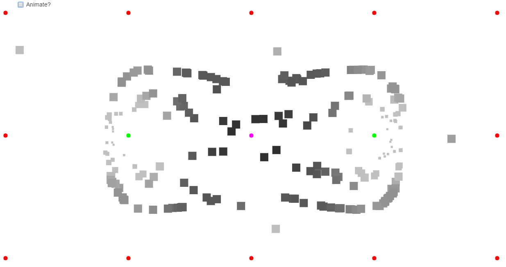

# Aufgabe 2: Partikel und Blending

Die hier gezeigte Partikel-Engine beherrscht eine beliebige Anzahl Emitter (magenta Punkt), Attraktoren (grüner Punkt) und Repelloren (roter Punkt).  

Weitere Eigenschaften:

* die Farbe eines Partikels wird durch dessen Beschleunigung bestimmt. Ein roter Partikel bewegt sich gar nicht bis langsam und ein maximal beschleunigter Partikel ist blau. Zwischen diesen beiden Farben wird geblendet. Siehe: [02-Color.coffee](https://github.com/xge/generative-gestaltung/blob/master/02-particles/02-Color.coffee#L8)